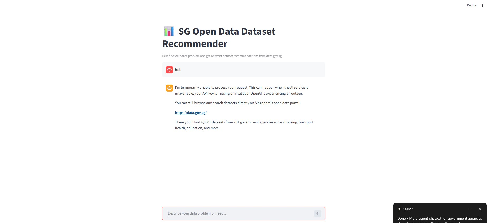

# SG Open Data Agentic Dataset Recommender

A multi-agent AI system that recommends datasets from Singapore's Open Data Portal (data.gov.sg) based on user problems. Uses a meta-controller supervisor architecture with 10 category-specific subagents running in parallel.

## Sample


When the OpenAI API is unavailable or the API key is invalid, the app shows a fallback message that directs users to [data.gov.sg](https://data.gov.sg/):



## Architecture

- **Supervisor Agent**: Classifies user queries and routes to 1–3 relevant category agents. Recognizes Singapore government agency names (HDB, LTA, MOH, etc.) and maps them to appropriate categories.
- **Category Agents**: Arts & Culture, Education, Economy, Environment, Geospatial, Housing, Health, Social, Transport, Real-time APIs. Run in parallel using async execution.
- **Synthesizer**: Aggregates recommendations into a unified response with dataset links.

All agents use OpenAI GPT-5.1 for reasoning and tool execution.

**Performance features:**
- Async parallel execution with `asyncio` for concurrent category searches
- Memory checkpointing with SQLite for caching and resumability
- Thread-safe execution with proper Streamlit context handling

If the OpenAI API is unavailable or `OPENAI_API_KEY` is missing/invalid, the app responds with a fallback message directing you to [data.gov.sg](https://data.gov.sg/).

### Tools Available to Agents

- `get_dataset_metadata`: Fetch detailed schema for a specific dataset
- `search_datasets`: Search datasets by keywords with optional agency filter
- `list_datasets_by_agency`: List all datasets from a specific agency

## Setup

1. Create a `.env` file with:
   ```
   OPENAI_API_KEY=your_openai_api_key
   LANGSMITH_API_KEY=your_langsmith_key  # optional, for tracing
   ```

2. Install dependencies with [uv](https://docs.astral.sh/uv/):
   ```bash
   uv sync
   ```

3. Run the Streamlit app:
   ```bash
   uv run streamlit run app.py
   ```

## Troubleshooting (Windows)

### `OPENSSL_Uplink: no OPENSSL_Applink`

This usually means `SSLKEYLOGFILE` is set by network monitoring software (e.g. NetLimiter). The app clears it on startup automatically.

If it still fails, unset it in your terminal before running:

```powershell
Remove-Item Env:SSLKEYLOGFILE -ErrorAction SilentlyContinue
uv run streamlit run app.py
```

### `SSL: CERTIFICATE_VERIFY_FAILED` / `APIConnectionError`

This occurs when your network uses SSL inspection (corporate proxy, firewall, or antivirus intercepting HTTPS). Python's default certificate store doesn't trust these proxy certificates.

**Solution:** Install `truststore` to use Windows' native certificate store:

```powershell
uv add truststore --native-tls
```

The `--native-tls` flag is required because uv itself may fail to connect to PyPI without it.

Once installed, the app will automatically use Windows certificates on startup. If you're still having issues, ensure your corporate/proxy CA certificate is installed in Windows Certificate Manager.

## Project Structure

```
ask-sg-agencies/
├── img/                   # Screenshots and assets
├── app.py                 # Streamlit entrypoint
├── agent/                 # Supervisor, synthesizer, category agent runner
├── config/                # LLM configuration and agency-to-category mapping
├── prompt/                # System prompts for each agent
├── tools/                 # Dataset search and metadata tools
└── src/                   # State, graph, agent runner
```

## Supported Agencies

The system recognizes mentions of Singapore government agencies and routes queries accordingly:

| Category | Agencies |
|----------|----------|
| Housing | HDB, URA, SLA |
| Transport | LTA, SMRT, SBS Transit |
| Health | MOH, HPB, HSA |
| Environment | NEA, PUB, NParks |
| Education | MOE, SkillsFuture, SSG |
| Economy | ACRA, EDB, ESG, MAS, IRAS, MOM, CPF |
| Social | MSF, NCSS |
| Arts & Culture | NAC, NHB, NLB, MCCY |
| Geospatial | SLA, OneMap |
| Real-time APIs | GovTech, IMDA |
