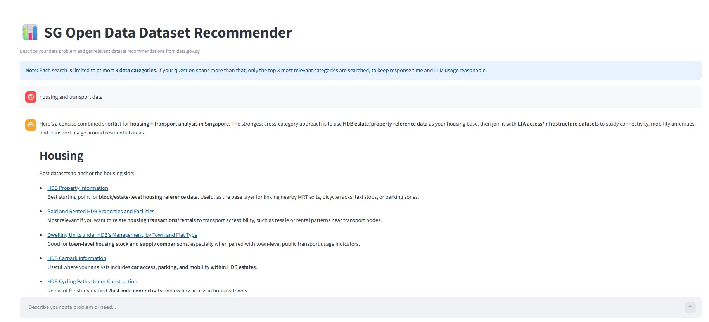
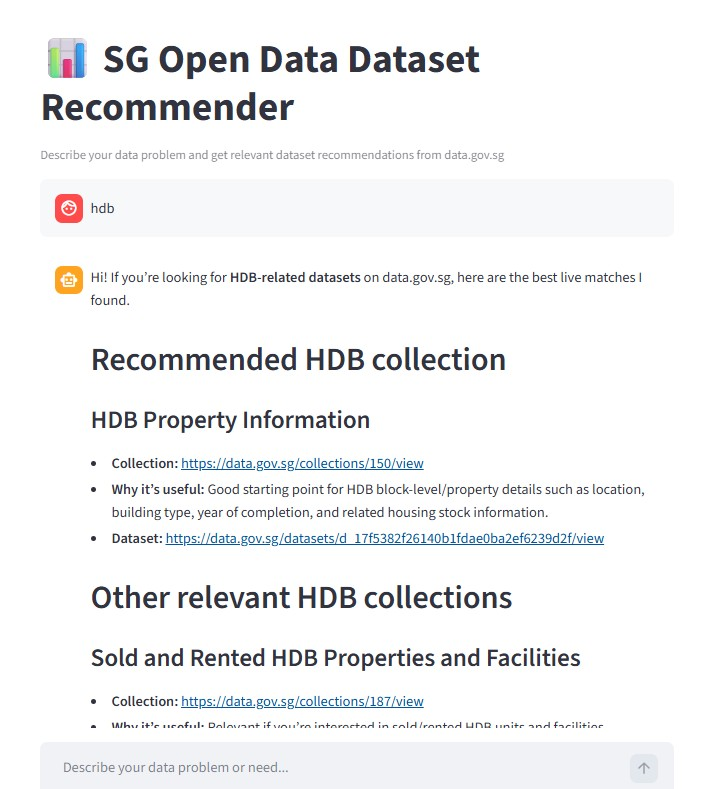
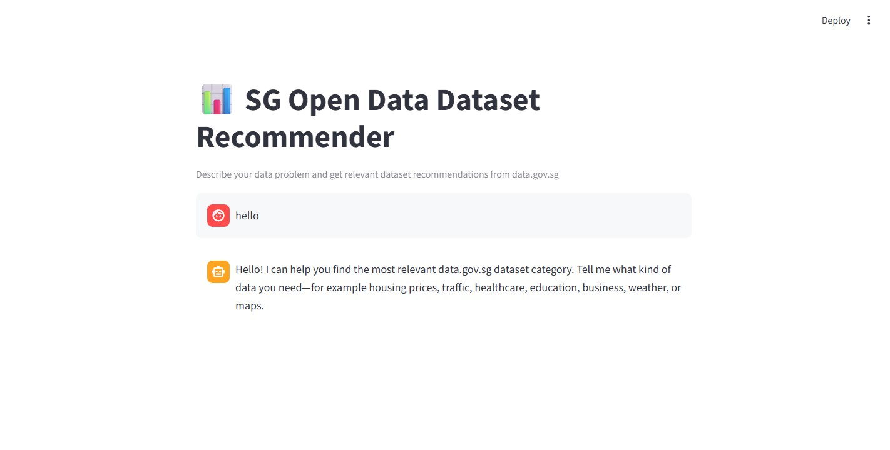
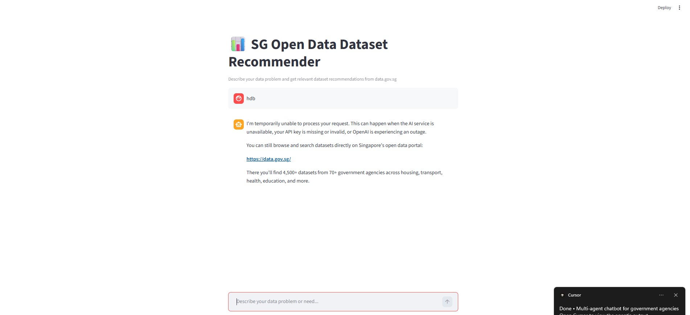

# SG Open Data Agentic Dataset Recommender

An agentic AI system that recommends datasets from Singapore's Open Data Portal (data.gov.sg) based on user problems. Uses a supervisor-router architecture that routes each query to the single most relevant category agent.

## Sample



For a relevant query (e.g. mentioning an agency like HDB), the category agent searches live data.gov.sg collections and returns a concise recommendation with direct links:



When a query is irrelevant or unclear, the supervisor responds with a friendly clarification prompt rather than searching for datasets:



When the OpenAI API is unavailable or the API key is invalid, the app shows a fallback message that directs users to [data.gov.sg](https://data.gov.sg/):



## Architecture

- **Supervisor Agent**: Classifies user queries and routes to the single most relevant category agent. Recognizes Singapore government agency names (HDB, LTA, MOH, etc.) and maps them to appropriate categories. Handles greetings, off-topic queries, and vague inputs with friendly clarification prompts.
- **Category Agent**: One of 10 specialists (Arts & Culture, Education, Economy, Environment, Geospatial, Housing, Health, Social, Transport, Real-time APIs) selected by the supervisor per query.

All agents use OpenAI GPT-5.4 for reasoning and tool execution.

**Features:**
- Memory checkpointing with `MemorySaver` for conversation continuity within a session
- Graceful handling of irrelevant queries without invoking any search tools
- Fallback response when the OpenAI API is unavailable, directing users to [data.gov.sg](https://data.gov.sg/)

### Tools Available to Agents

- `get_dataset_metadata`: Fetch detailed schema for a specific dataset
- `search_datasets`: Search datasets by keywords with optional agency filter
- `list_datasets_by_agency`: List all datasets from a specific agency

## Setup

1. Create a `.env` file with:
   ```
   OPENAI_API_KEY=your_openai_api_key
   LANGSMITH_API_KEY=your_langsmith_key  # optional, for tracing
   ```

2. Install dependencies with [uv](https://docs.astral.sh/uv/):
   ```bash
   uv sync
   ```

3. Run the Streamlit app:
   ```bash
   uv run python run.py
   ```

   > **Windows users:** Use `run.py` instead of `streamlit run app.py` directly. It applies SSL patches before Streamlit loads, preventing `APIConnectionError` caused by SSL initialisation order (see Troubleshooting below).

## Troubleshooting (Windows)

### `APIConnectionError: Connection error` on Streamlit but not on plain Python scripts

When running via `uv run streamlit run app.py`, Streamlit and its HTTP dependencies (uvicorn, httpx) initialise the `ssl` module before your app code runs. This means the Windows SSL patch — which clears `SSLKEYLOGFILE` and injects the native certificate store via `truststore` — runs too late.

**Solution:** Always use the provided launcher:

```bash
uv run python run.py
```

`run.py` applies the patch first, then programmatically starts Streamlit, ensuring SSL is configured before any HTTPS connections are made.

### `OPENSSL_Uplink: no OPENSSL_Applink`

This usually means `SSLKEYLOGFILE` is set by network monitoring software (e.g. NetLimiter). The app clears it on startup automatically via the launcher.

If it still fails, unset it in your terminal before running:

```powershell
Remove-Item Env:SSLKEYLOGFILE -ErrorAction SilentlyContinue
uv run python run.py
```

### `SSL: CERTIFICATE_VERIFY_FAILED`

This occurs when your network uses SSL inspection (corporate proxy, firewall, or antivirus intercepting HTTPS). Python's default certificate store doesn't trust these proxy certificates.

**Solution:** Install `truststore` to use Windows' native certificate store:

```powershell
uv add truststore --native-tls
```

The `--native-tls` flag is required because uv itself may fail to connect to PyPI without it.

Once installed, the launcher will automatically use Windows certificates on startup. If you're still having issues, ensure your corporate/proxy CA certificate is installed in Windows Certificate Manager.

## Project Structure

```
ask-sg-agencies/
├── img/                   # Screenshots and assets
├── app.py                 # Streamlit UI entrypoint
├── run.py                 # Launcher (apply SSL patch before Streamlit loads)
├── agent/                 # Supervisor and category agent runner
├── config/                # LLM configuration, SSL patch, error handling
├── prompt/                # Jinja2 templates and system prompts for each agent
│   └── templates/         # Shared base template and category_agent.jinja2
├── tools/                 # Dataset search and metadata tools
└── src/                   # State definition, LangGraph workflow, agent runner
```

## Supported Agencies

The system recognizes mentions of Singapore government agencies and routes queries accordingly:

| Category | Agencies |
|----------|----------|
| Housing | HDB, URA, SLA |
| Transport | LTA, SMRT, SBS Transit |
| Health | MOH, HPB, HSA |
| Environment | NEA, PUB, NParks |
| Education | MOE, SkillsFuture, SSG |
| Economy | ACRA, EDB, ESG, MAS, IRAS, MOM, CPF |
| Social | MSF, NCSS |
| Arts & Culture | NAC, NHB, NLB, MCCY |
| Geospatial | SLA, OneMap |
| Real-time APIs | GovTech, IMDA |
